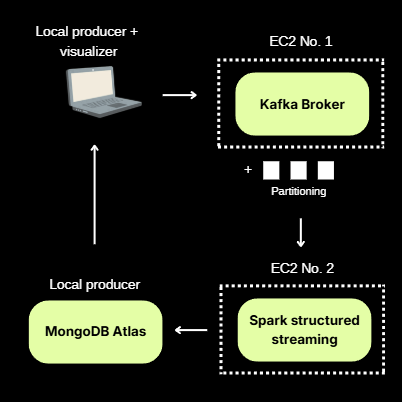

# PROJECT OVERVIEW

## 📌 PROBLEM STATEMENT

The current vehicle speed ingestion pipeline is implemented using a local deployment of Apache Kafka, Spark Structured Streaming, and a self-hosted MongoDB instance. While functional, this local architecture results in tight coupling between components, making the system less modular and more difficult to manage.

In particular, troubleshooting becomes challenging when failures occur, as all components run within the same local environment with limited isolation. This setup also restricts scalability and does not accurately reflect real-world distributed streaming architectures. As a result, there is limited visibility into system performance bottlenecks across ingestion, processing, and storage layers.

To address these limitations, a more distributed and modular architecture is required to improve fault isolation, observability, and system realism.

## 📚 LITERATURE REVIEW

Kelvin (Kelvin, 2023) proposed a real-time data processing architecture integrating Apache Kafka with Spark Structured Streaming for scalable and low-latency stream processing. The study demonstrates that Kafka serves effectively as a high-throughput ingestion layer, while Spark Structured Streaming enables real-time distributed processing. This decoupled design improves both throughput and latency performance, and provides a scalable foundation for streaming applications.

In addition, performance tuning studies on Kafka–Spark systems highlight the importance of Kafka topic partitioning as a key mechanism for improving parallel processing. Partitioning enables multiple Spark consumers to process data concurrently, reducing bottlenecks and improving overall system throughput in streaming pipelines (Hung et al., 2025).

## 🏗️ DESIGN INFLUENCE

These findings informed the design of the proposed system, which adopts a Kafka → Spark Structured Streaming → MongoDB Atlas pipeline deployed across AWS EC2 instances. To support parallel processing, three Kafka topics (camera-events-A, B, and C) were created, each configured with three partitions. This design preserves the core architectural principles from the articles while adapting the implementation to AWS Free Tier constraints.

## EXTENDING ASSIGNMENT 2
Previously, the producer, Kafka, Spark Structured Streaming, and visualization components were deployed within a single local Spark container, resulting in a tightly coupled architecture with limited modularity and scalability.

Based on our research, a new distributed architecture is proposed, separating components across cloud-based EC2 instances to improve system modularity, fault isolation, and observability.



## INNOVATION AND TECHNICAL COMPLEXITY
| Area                                                       | Description                                                                                                                                                                              |
| ---------------------------------------------------------- | ---------------------------------------------------------------------------------------------------------------------------------------------------------------------------------------- |
| **Resource-Constrained EC2 Deployment Design**             | Navigated AWS Free Tier limitations in compute and storage to identify an effective balance for workload distribution across Kafka, Spark Structured Streaming, and supporting services. |
| **Optimised System Configuration for Workload Allocation** | Designed and refined component placement and resource usage to achieve stable and efficient processing under constrained infrastructure.                                                 |
| **Enhanced Scalability Through Kafka Topic Partitioning**  | Introduced Kafka partitioning for each camera event topic to improve parallel processing, throughput, and horizontal scalability beyond the initial system design.                       |
| **Decoupled Storage Layer via MongoDB Atlas Integration**  | Offloaded data persistence to MongoDB Atlas to reduce resource contention on EC2 instances and improve system modularity and overall performance efficiency.                             |


## TECHNICAL CHANGES SINCE ASSIGNMENT 2

- **Decoupled system architecture** by separating the Producer, Kafka, Spark Structured Streaming, and MongoDB components to improve modularity and maintainability.

- **Deployed Kafka and Spark Structured Streaming on AWS EC2**, including structured deployment steps to support distributed execution.

- **Implemented system stability improvements under resource constraints**, including the use of swap memory to prevent EC2 instances from crashing due to RAM limitations.

- **Enriched streaming pipeline with latency analysis**, tracking end-to-end delay from producer event generation to Spark Structured Streaming ingestion.


### Latency Analysis Implementation

A structured schema was introduced to capture event timing information for performance evaluation:

```python
schema = StructType([
    StructField("batch_id", IntegerType()),
    StructField("camera_id", IntegerType()),
    StructField("producer_id", StringType()),
    StructField("events",
        ArrayType(
            StructType([
                StructField("event_id", StringType()),
                StructField("car_plate", StringType()),
                StructField("timestamp", StringType()),
                StructField("speed_reading", StringType()),
                StructField("producer_sent_time", StringType())
            ])
        )
    )
])

```

Latency was computed within Spark Structured Streaming using timestamp differences:

```python
def get_latency(df):
    return df.withColumn("ingest_time", current_timestamp()) \
        .withColumn(
            "latency_seconds",
            expr("unix_timestamp(ingest_time) - unix_timestamp(producer_sent_time)")
        )
```

### Kafka Topic Partitioning

Kafka topics were configured with partitioning to improve parallel processing and throughput:

```bash
# Create Topic A
kafka-topics.sh --bootstrap-server localhost:9092 \
--create --topic camera-events-A \
--partitions 3 --replication-factor 1

# Create Topic B
kafka-topics.sh --bootstrap-server localhost:9092 \
--create --topic camera-events-B \
--partitions 3 --replication-factor 1

# Create Topic C
kafka-topics.sh --bootstrap-server localhost:9092 \
--create --topic camera-events-C \
--partitions 3 --replication-factor 1
```

### Performance Monitoring and MongoDB Logging

Streaming performance metrics were continuously logged into MongoDB for real-time analysis of system throughput and processing efficiency:

```python
stream_metrics.insert_one({
    "query": query_name,
    "batch_id": batch_id,
    "timestamp": progress["timestamp"],
    "num_input_rows": progress["numInputRows"],
    "input_rows_per_second": progress["inputRowsPerSecond"],
    "processed_rows_per_second": progress["processedRowsPerSecond"]
})
```

## RESEARCH ARTICLES
- https://www.researchgate.net/publication/396645280_INTEGRATING_APACHE_KAFKA_WITH_SPARK_STRUCTURED_STREAMING_FOR_LOW-LATENCY_DATA_PROCESSING_IN_BIG_DATA_ARCHITECTURES
- https://developer.hpe.com/blog/performance-tuning-of-an-apache-kafkaspark-streaming-system/
